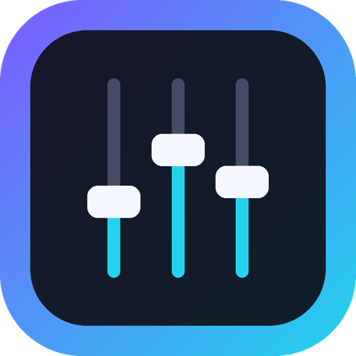

# MakerDash

> Früher „Pico Dashboard“.

Ein selbstgebautes Mischpult für den PC: drei Fader, ein Drehgeber und ein OLED-Display an einem
Raspberry Pi Pico 2 steuern Systemlautstärke, Mikrofon und einzelne Programme unter Windows.

<p align="center"></p>

## Funktionen

- **Fader 1/2:** Systemlautstärke oder Mikrofon (in der App einstellbar)
- **Fader 3:** ein Programm nach Wahl – am Dashboard im Menü oder in der App auswählbar
- **Menü am Dashboard:** Programm für Fader 3, Ausgabegerät und Mikrofon umschalten
- **Display:** Start-Animation, Lautstärke-Anzeige, Bildschirmschoner
- **App:** moderne Oberfläche, Live-Anzeige, Umbenennen/Ausblenden von Programmen und Geräten
- **Firmware-Verwaltung:** Die App spielt die Pico-Software selbst auf und aktualisiert sie
- **Automatische Updates** über GitHub Releases

## Installation

1. Neueste `MakerDash-Setup.exe` unter **Releases** herunterladen und starten.
2. Der Einrichtungsassistent führt durch das Anschließen. Ein neuer Pico wird im BOOTSEL-Modus
   (Taste gedrückt halten und einstecken) erkannt und komplett eingerichtet.

Benötigt Windows 10/11 (64 Bit) mit WebView2 Runtime (bei Windows 11 vorinstalliert).

## Verdrahtung (Standard)

| Bauteil | Pin |
|---|---|
| Fader 1 | GP28 |
| Fader 2 | GP27 |
| Fader 3 | GP26 |
| Encoder A / B / Taster | GP10 / GP11 / GP12 |
| OLED SDA / SCL | GP4 / GP5 |
| Fader & OLED Versorgung | 3V3(OUT), GND |

Die Belegung lässt sich in der App unter **Dashboard → Verdrahtung** ändern.

## Neue Version veröffentlichen

1. Versionsnummer in der Datei `VERSION` erhöhen (z. B. `2.1.0`)
2. optional: Beschreibung in `release-notes/v2.1.0.md` anlegen
3. committen und auf `main` pushen

GitHub baut daraufhin App und Installer (`.github/workflows/release.yml`), legt den Tag `v2.1.0` an
und veröffentlicht alles als Release. (Ein gepushter Tag `v*` funktioniert ebenfalls.)
Installierte Apps finden das Update automatisch. Wird `firmware/code.py` (`FW_VERSION`) geändert,
aktualisiert die App danach auch das Dashboard.

> Das Repository muss **öffentlich** sein, damit die App Updates ohne Anmeldung abrufen kann.

## Aufbau

| Pfad | Inhalt |
|---|---|
| `*.go` | Windows-App (Go, ohne cgo) |
| `ui/index.html` | Oberfläche (läuft in WebView2) |
| `firmware/` | Pico-Firmware (CircuitPython), wird in die App eingebettet |
| `installer/` | NSIS-Installer |

Lokal bauen (Linux oder Windows, Go ≥ 1.24):

```bash
GOOS=windows GOARCH=amd64 go build -ldflags "-H windowsgui -X main.AppVersion=2.1.0" -o dist/MakerDash.exe .
cd installer && makensis -DVERSION=2.1.0 setup.nsi
```

Die Bibliotheken in `firmware/lib` stammen von Adafruit (MIT-Lizenz).
