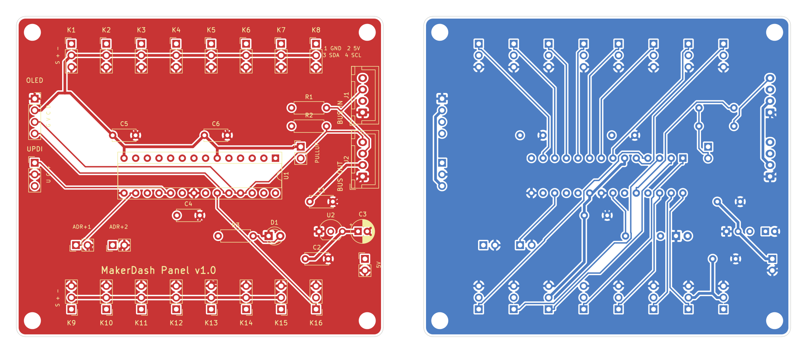
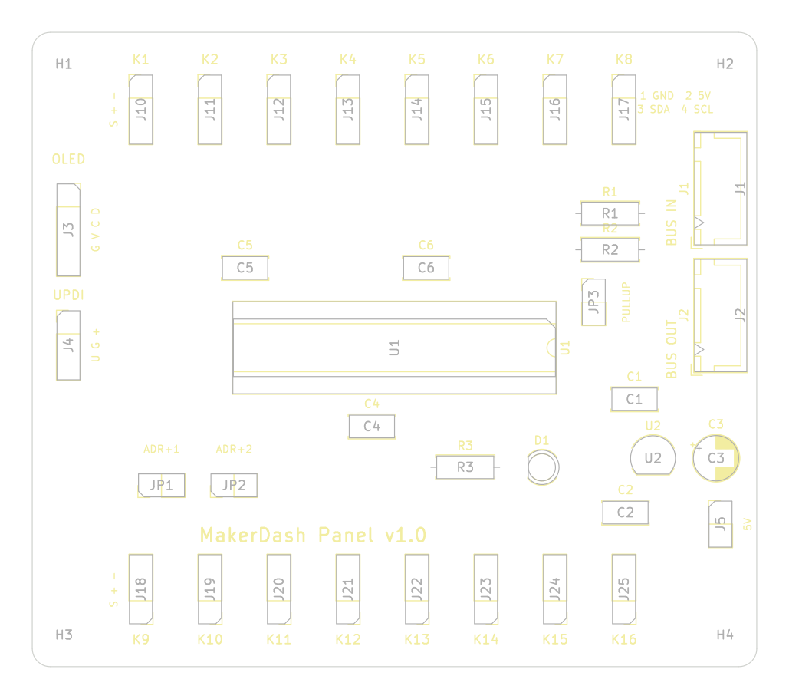

# MakerDash Panel-Platine v1.0

Zwischenplatine zwischen Pico und Bedienelementen: Fader, Drehgeber, Taster und das Display hängen
an dieser Platine, der Pico ist nur noch über **4 Adern** angeschlossen und belegt **2 GPIOs** (I2C)
statt bisher 8.

## Überblick

| | |
|---|---|
| Größe | 80 × 70 mm, 2 Lagen, 4 Bohrungen M3 (3,5 mm vom Rand) |
| Controller | **AVR64DD28-I/SP** (DIP-28, im Sockel), 3,3 V, interner Takt |
| Versorgung | 5 V vom Pico (VBUS) → eigener Regler **MCP1700-3302E** (3,3 V, 250 mA) |
| Anschluss Pico | JST-XH 4-polig: GND · 5 V · SDA · SCL |
| Kanäle | **16 Universal-Kanäle** K1–K16, je 3 Pins: Signal · +3,3 V · GND |
| Display | Buchse für SSD1306-OLED (I2C), hängt am selben Bus |
| Bauteile | ausschließlich Durchsteck-Bauteile (THT) |

Alle Bauteile werden von Hand gelötet, es gibt keine SMD-Teile.

## Anschluss an den Pico

| Panel J1 „BUS IN“ | Pico 2 |
|---|---|
| 1 GND | GND (z. B. Pin 38) |
| 2 5V | VBUS (Pin 40) |
| 3 SDA | GP4 (Pin 6) – wie bisher das Display |
| 4 SCL | GP5 (Pin 7) |

Der Pico spricht als I2C-Controller mit zwei Teilnehmern: dem Panel-Controller (Adresse **0x30**)
und dem Display (**0x3C**). Über **J2 „BUS OUT“** lassen sich weitere Panels anhängen. Jede Platine
bekommt dann über **JP1/JP2** eine eigene Adresse (0x30–0x33).

**Pull-ups (JP3):** Den Jumper nur auf **einer** Platine am Bus stecken.

## Universal-Kanäle

Jede Kanalleiste: **1 = Signal**, **2 = +3,3 V**, **3 = GND** (Bestückungsdruck „S + –“).

| Bauteil | Anschluss |
|---|---|
| Fader / Poti | Schleifer → 1, Enden → 2 und 3 (ein Ende an +3,3 V, eins an GND) |
| Taster | 1 und 3 (interner Pull-up im Controller) |
| Drehgeber | A an Signal von Kanal n, B an Signal von Kanal n+1, gemeinsamer Pin an GND; Taster als eigener Kanal |
| LED | Signal → Vorwiderstand → LED → GND |

Was ein Kanal ist (analog, Taster, Drehgeber, LED), legt die Firmware bzw. die App fest. Die Platine
ist für alle Panels gleich.

| Kanal | Pin am Chip | analog | | Kanal | Pin am Chip | analog |
|---|---|---|---|---|---|---|
| K1 | PD7 (13) | AIN7 | | K9 | PC2 (4) | AIN30 |
| K2 | PD6 (12) | AIN6 | | K10 | PC1 (3) | AIN29 |
| K3 | PD5 (11) | AIN5 | | K11 | PC0 (2) | AIN28 |
| K4 | PD4 (10) | AIN4 | | K12 | PA7 (1) | AIN27 |
| K5 | PD3 (9) | AIN3 | | K13 | PA4 (26) | AIN24 |
| K6 | PD2 (8) | AIN2 | | K14 | PA5 (27) | AIN25 |
| K7 | PD1 (7) | AIN1 | | K15 | PA6 (28) | AIN26 |
| K8 | PC3 (5) | AIN31 | | K16 | PA1 (23) | nur digital |

Weitere Pins: PA2/PA3 = I2C (SDA/SCL), PA0 = Status-LED, PF0/PF1 = Adress-Jumper, UPDI (19) = Programmieren.

**Für das jetzige Dashboard:** Fader 1–3 an K1–K3, Drehgeber A/B an K4/K5, Drehgeber-Taster an K6,
Display in J3.

## Stückliste

| Ref | Bauteil | Anzahl |
|---|---|---|
| U1 | AVR64DD28-I/SP (DIP-28) | 1 |
| – | IC-Sockel DIP-28, schmal (7,62 mm) | 1 |
| U2 | MCP1700-3302E/TO (TO-92) | 1 |
| C1, C2 | Keramik-Kondensator 1 µF, Rastermaß 5 mm | 2 |
| C3 | Elko 10 µF ≥ 6,3 V, Ø 5 mm, Rastermaß 2 mm | 1 |
| C4, C5, C6 | Keramik-Kondensator 100 nF, Rastermaß 5 mm | 3 |
| R1, R2 | Widerstand 4,7 kΩ (0207) | 2 |
| R3 | Widerstand 1 kΩ (0207) | 1 |
| D1 | LED 3 mm grün | 1 |
| J1, J2 | JST-XH 4-polig stehend (B4B-XH-A) + Stecker XHP-4 und Crimpkontakte | 2 |
| J3 | Buchsenleiste 1×4, 2,54 mm (für das OLED-Modul) | 1 |
| J4 | Stiftleiste 1×3 (UPDI) | 1 |
| J5, JP1, JP2, JP3 | Stiftleiste 1×2 + 3 Jumper | 4 |
| J10–J25 | Stiftleiste 1×3 (Kanäle K1–K16), nur die benötigten bestücken | bis 16 |
| – | Abstandshalter M3 | 4 |

## Platine bestellen

Bestellliste mit Teilenummern: [BESTELLLISTE.md](BESTELLLISTE.md).

`makerdash-panel-gerber.zip` bei einem Platinenhersteller hochladen, z. B. JLCPCB, PCBWay oder
Aisler. Einstellungen: 2 Lagen, 1,6 mm, keine Bestückung. Die Datei enthält Kupfer, Lötstopp,
Bestückungsdruck, Kontur und Bohrdaten.

## Aufbau

1. Flache Teile zuerst: Widerstände, Keramik-Kondensatoren, IC-Sockel (Kerbe nach rechts zu den Bus-Buchsen, Pin 1 oben rechts).
2. Regler U2 (flache Seite wie im Bestückungsdruck), Elko C3 (+ beachten), LED D1 (kurzes Bein = Kathode).
3. Stiftleisten, Buchsenleiste, JST-Buchsen.
4. **Vor dem Einsetzen des Chips:** 5 V anlegen und an J4 Pin 3 bzw. Kanal-Pin 2 **3,3 V** messen.
5. Chip einsetzen.

## Programmieren

Der Controller wird einmalig über **UPDI** (J4: 1 UPDI · 2 GND · 3 +3,3 V) programmiert. Dazu reicht
ein USB-Seriell-Adapter mit 3,3 V nach der SerialUPDI-Anleitung von DxCore. Die Firmware für den
Controller und die Anpassung der Pico-Firmware und der App folgen als nächster Schritt. Bis dahin
funktioniert die Platine noch nicht mit MakerDash.

## Offene Punkte vor der Bestellung

- Die Pinbelegung des AVR64DD28 stammt aus der DxCore-Dokumentation. Im KiCad-Symbol wird der
  pin-kompatible AVR DB28 verwendet. **Vor dem Bestellen gegen das Microchip-Datenblatt
  (DS40002315) prüfen.**
- OLED-Module gibt es mit vertauschten Pins GND/VCC. J3 ist für die Reihenfolge
  **GND · VCC · SCL · SDA** ausgelegt.

## Dateien

| Datei | Inhalt |
|---|---|
| `makerdash-panel.kicad_sch / .kicad_pcb / .kicad_pro` | KiCad-7-Projekt (mit KiCad öffnen und bearbeiten) |
| `makerdash-panel-schaltplan.pdf` | Schaltplan zum Ausdrucken |
| `makerdash-panel-gerber.zip` | Fertigungsdaten |
| `gen_schematic.py`, `gen_pcb.py`, `build.sh` | erzeugen alles neu (Platzierung, Routing mit Freerouting, DRC, Gerber) |
